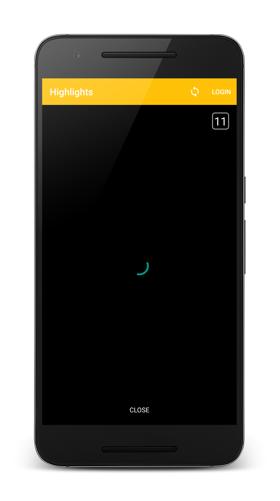
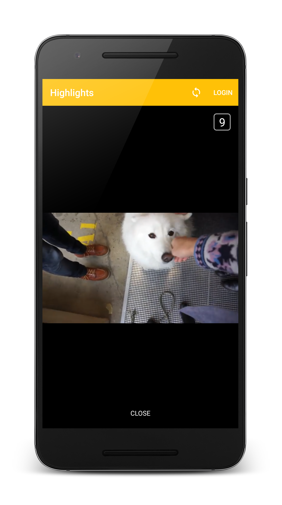

# Highlights

A product of [YHack '16](http://www.yhack.org/). Built by Aaron Vontell, Ali Benlalah & Cooper Pellaton.

## Table of Contents
- [Overview](#overview)
- [Video Walkthrough](#video-walkthrough)
- [Screenshots](#screenshots)
- [Machine Learning and More](#machine-learning-and-more)
- [Our Infrastructure](#our-infrastructure)
- [API](#api)

## Overview

The first thing you're probably thinking is what this ambiguiously named application is, and secondly, you're likely wondering why it has any significance. Firstly, Highlights is the missing component of your YouTube life, and secondly it's important because we leverage Machine Learning to find out what content is most important in a particular piece of media unlike it has ever been done before.

Imagine this scenario: you subscribe to 25+ YouTube channels but over the past 3 weeks you simply haven't had the time to watch videos because of work. Today, you decide that you want to watch one of your favorite vloggers, but realize you might lack the context to understand what has happened in her/his life since you last watched which lead her/him to this current place. Here enters Highlights. Simply download the Android application, log in with your Google credentials and you will be able to watch the so called *highlights* of your subscriptions for all of the videos which you haven't seen. Rather than investing hours in watching your favorite vlogger's past weeks worth of videos, you can get caught up in 30 seconds - 1 minute by simply being presented with all of the most important content in those videos in one place, seamlessly.

## Video Walkthrough
[](https://youtu.be/6fu5A1hEb_g)

## Screenshots
The homefeed view:


The loading screen:


The view of the player:




## Machine Learning and More

Now that you understand the place and signifiance of Highlights, a platform that can distill any media into bite sized chunks that can be consumed quickly in the order of their importance, it is important to explain the technical details of how we achieve such a gargantuant feat.

Here is a visual representation of the pipeline we are about to explain:


Let's break down the pipeline.

1. We start by accessing your Google account within the YouTube scope and get a list of your current subscriptions, 'activities' such as watched videos, comments, etc., your recommended videos and your home feed.

2. We take this data and extract the key features from it. Some of these include:
    - The number of videos watched on a particular channel.
    - The number of likes/dislikes you have and the categories on which they center.
    - The number of views a particular video has/how often you watch videos after they have been posted.
    - Number of days after publication. This is most important in determing the signficiance of a reccomended video to a particular user.
    We go about this process for every video that the user has watched, or which exists in his or her feed to build a comprehensive feature set of the videos that are in their own unique setting.

3. We proceed by feeding the data from the aforementioned investigation and probabilities by then generating a new machine learning model which we use to determine the likelihood of a user watching any particular reccomended video, etc.

4. For each video in the set we are about to iterate over, the video is either a recomended watch, or a video in the user's feed which she/he has not seen. They key to this process is a system we like to call 'video quanitization'. In this system we break each video down into it's components. We look at the differences between images and end up analyzing something near to every other 2, 3, or 4 frames in a video. This reduces the size of the video that we need to analyze while ensuring that we don't miss anything important. As you will not here, a lot of the processes we undertake have bases in very comprehensive and confusing mathematics. We've done our best to keep math out of this, but know that one of the most important tools in our toolset is the exponential moving average.

5. This is the most important part of our entire process, the scene detection. To distill this down to it's most basic principles we use features like lighting, edge/shape detection and more to determine how similar or different every frame is from the next. Using this methodology of trying to find the frames that are different we coin this change in setting a 'scene'. Now, 'scenes' by themselves are not exciting but coupled with our knowledge of the context of the video we are analyzing we can come up with very apt scenes. For instance, in a horror movie we know that we would be looking for something like 5-10 seconds in differences between the first frame of that series and the last frame; this is what is referred to as a 'jump' or 'scare' cut. So using our exponential moving average, and background subtraction we are able to figure out the changes in between, and validate scenes.

6. We pass this now deconstructed video into the next part of our pipeline where we will generate unique vectors for each of them that will be used in the next stage. What we are looking for here is the key features that define a frame. We are trying to understand, for example, what makes a 'jump' cut a 'jump' cut. Features that we are most commonly looking include 
    - Intensity of an analyzed area.
        - EX: The intensity of a background coloring vs edges, etc.
    - The length of each scence.
    - Background.
    - Speed.
    - Average Brightness
    - Average background speed.
    - Position
    - etc.
Armed with this information we are able to derive a unqiue column vector for each scence which we will then feed into our neural net.

7. The meat and bones of our operation: the **neural net**! What we do here is not terribly complicated. At it's most basic principles, we take each of the above column vectors and feed it into this specialized machine learning model. What we are looking for is to derive a sort order for these features. Our initial training set, a group of 600 YouTube videos which @Ali spent a significant amount of time training, is used to help to advance this net. The gist of what we are trying to do is this: given a certain vector, we want to determine it's signifiance in the context of the YouTube univerise in which each of our users lives. To do this we abide by a semi-supervised learning model in which we are looking over the shoulder of the model to check the output. As time goes on, this model begins to tweak it's own parameters and produce the best possible output given any input vector.

8. Lastly, now having a sorted order of every scene in a user's YouTube universe, we go about reconstructing the top 'highlights' for each user. IE in part 7 of our pipeline we figured out which vectors carried the greatest weight. Now we want to turn these back into videos that the user can watch, quickly, and derive the greatest meaning from. Using a litany of Google's APIs we will turn the videoIds, categories, etc into parameterized links which the viewer is then shown within our application.

## Our Infrastructure

Our service is currently broken down into the following core components:

- Highlights Android Application
    - Built and tested on Android 7.0 Nougat, and uses the YouTube Android API Sample Project
    - Also uses various open source libraries (OkHTTP, Picasso, ParallaxEverywhere, etc...)
- Highlights Web Service (Backs the Pipeline)
- The 'Highlighter' or rather our ML component


## API

### POST

- `/api/get_subscriptions`

    This requires the client to `POST` a body of the nature below. This will then trigger the endpoint to go and query the YouTube API for the user's subscriptions, and then build a list of the most recent videos which he/she has not seen yet.
    ```json
    {
        "user":"Cooper Pellaton"
    }
    ```

- `/api/get_videos`

    *DEPRECATED*. This endpoint requires the client to `POST` a body similar to that below and then will fetch the user's most recent activity in list form from the YouTube API.
    ```json
    {
        "user":"Cooper Pellaton"
    }
    ```

### GET

-  `/api/fetch_oauth`

    So optimally, what should happen when you call this method is that the user should be prompted to enter her/his Google credentials to authorize the application to then be able to access her/his YouTube account. 
        - The way that this is currently architected, the user's entrance into our platform will immediately trigger learning to occur on their videos. We have since *DEPRECATED* our ML training endpoint in favor of one `GET` endpoint to retrieve this info.

-   `/api/fetch_subscriptions`

    To get the subscriptions for a current user in list form simply place a `GET` to this endpoint. Additionally, a call here will trigger the ML pipeline to begin based on the output of the subscriptions and user data.

-   `/api/get_ml_data`

    For each user there is a queue of their Highlights. When you query this endpoint the response will be the return of a dequeue operation on said queue. Hence, you are guaranteed to never have overlap or miss a video.
        - To note: in testing we have a means to bypass the dequeue and instead append, constantly, directly to the queue so that you can ensure you are retrieving the appropriate response.
